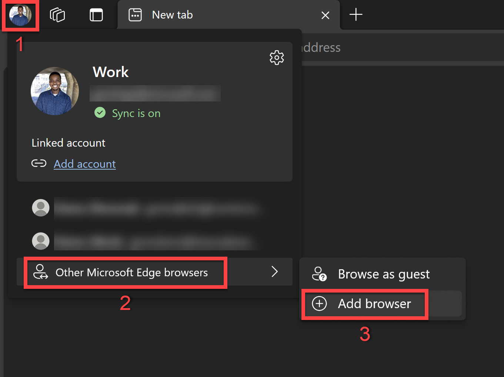
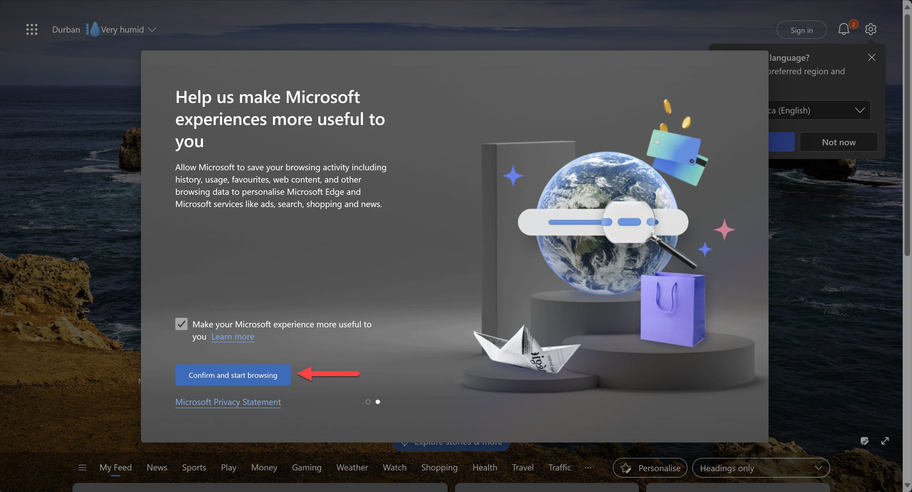

# Lab 00 - Preparations & Environment

In this lab, you will go through the following tasks:

* Creating a new browser profile
* Logging into the account you are going to use during the workshop
* Access your Power Platform developer environment

## 👥 Create a new browser profile

It's always good to have a separate browser profile for your work and for workshops like this. This way you can keep all of your credentials separate and not have to worry about logging out of your personal / work accounts. In the example we will be using Microsoft Edge, **instead you can also use any other Browser, just make sure to use a profile where you are not logged in with any other Microsoft Account!**

### Install Microsoft Edge

Microsoft Edge comes pre-installed on Windows 10 and 11. If you need to install or update it, otherwise go directly to the new step:

* Download from [microsoft.com/edge](https://www.microsoft.com/edge)
* Run the installer and follow the prompts
* Edge will auto-update in the background

### Create a new profile

1. Open Microsoft Edge
2. Click on the profile icon on the top left corner
3. Hover over "Other Microsoft Edge Browsers" / "Other profiles" and then select **Add Browser** / **Add profile**

    

4. Click **Add**

    

    This will then open up a new browser window on your taskbar.

5. Pin that browser window to your taskbar
6. In the new browser window, select **Start without your data**

    

7. Then select **Confirm and start browsing**.

    

    It may prompt you to configure your new browser theme. If this happens, just select **Next** and then **Finish**.

## 🗝️ Log on to your account

With the credentials that were provided to you, let's log into the account you are going to use during the workshop.

1. Go to [make.powerapps.com](https://make.powerapps.com)
2. On the sign-in screen, enter the email address that has been provided to you and then click **Next**

   

3. Then enter the Temporary Access Pass that has been provided to you and click **Sign in**

   

4. If you're prompted to stay signed in, click **Yes**
5. If you're prompted which region you want to use you can stay in the default United States and just click on  **Get Started**

6. Select **Yes** when being asked if you want to be signed in

    This will trigger the creation of your developer environment. The following loading screen will show:

    
7. After the loading is done you will be redirected to the actual maker portal. In our tenant Environment Routing is active so you should directly see your developer environment. Make sure that you are in the environment which has your user name and that the info about it being a developer environment is shown:

## 📂 Create a solution

Best Practice for everything in the Power Platform: Work INSIDE solutions. They are great for organizing your customizations and some features only work here plus they over ALM capabilities (remember from last lab?).

Because of that our first step in the Power Apps Maker portal is to navigate to **Solutions** on the left hand side and click on **New Solution**

In the dialog which open give your solution a meaningful name and select either create an own publisher by clicking **New** or use the **Default Publisher** named after your environment.

> [!NOTE]
> Using the Default Publisher is not considered best practice because you have no control about the technical prefix all your components will receive.

Congrats you have a solution for doing our Agent development! Every journey starts with the first step 💪