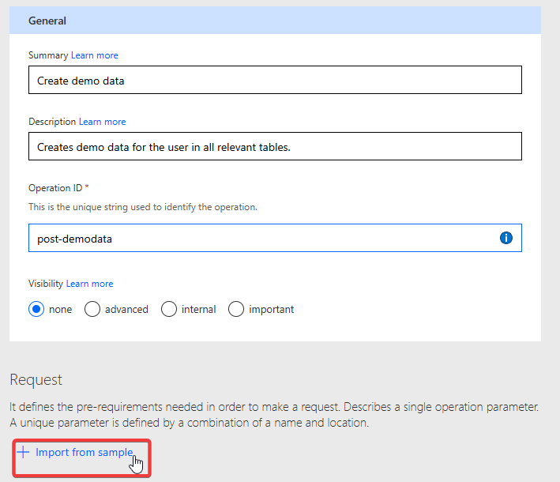

# Lab 01 - Build your first connector from scratch

In this lab, you will go through the following tasks:

* Create a connector in the solution
* Setup authentication
* Add operation with Parameters

We will use the community event API as an example to connect to. It's a simple demo API for event management. 

## 🔗 Create a connector from blank

As we learned before there are multiple ways to create a Custom Connector, we will use the most basic one to learn the basics 🙂

Inside your solution click on **New** and in the menu on **Automation** and then on **Custom Connector**

In a new tab the Custom Connector edit wizard will be opened in the first step.

First step is given your Custom Connector a meaningful name, make sure to use a name your users will understand, this will show up in all UIs. Bonus points if you also add an icon below under **General Information**. Also give it's a description and remember to update the description later when new actions and functionalities are added. You can use this one first:

"An event management API to work with community events. Can be used to retrieve information about events, including their sessions, tracks and more. Offers additional functionality to subscribe to changes and submit event forms."

Next you need to select **HTTPS** and fill in the **Host** and **Base URL**. The community event API can be reached via dhino (Middleware used to publish Dataverse data) under the following url. Do not fill the "https://" part in the host and you can only put the root URL until the first "/" there. The "Base URL" is the part of the URL which is common to all requests being done via this custom connector.

The Event API we are connecting to can be reached with this URL **https://fa-eventapi-us.azurewebsites.net/api**. You need to split this into the following parts in the wizard:

| Url Part | Value |
|-----|-------------|
| **Scheme** | HTTPS |
| **Host** | fa-eventapi-us.azurewebsites.net |
| **Base URL** | /api | 

 

## 🔐 Define Security / Authentication

Click on **Security** on the bottom or in the wizard status on top to move on to the next step. Authentication describes how the Custom Connector will authenticate with the API and the options to choose from depends on the used API.

For the Event API the authentication is done via an **API Key**, so select this option

After selecting you will asked to enter the label, name and location of parameter.

**Label:** This will be shown to the user when creating a new connection, shows a readable meaningful name

**Name:** This is the technical defined **by the API** so you can be creative here!

**Location:** This defines where the Custom Connector will add the API Key information when making requests.

The Community Event API will be authenticated by an API Key in the Header of each HTTP Request called **Ocp-Apim-Subscription-Key**

All done! Very important: **You do not need to enter any API Key in this step!** Authentication info is never stored directly in a Custom Connector but only ever in Connections. They will get created later when we are actually are using our Custom Connector.

## 📚 Create demo data

The Event API is a multi tenant application which separates data per user. So as a first step we want to create demo data for it. In this case we are lucky, the Event API offers an action for this, so we don't have to type anything manual!

Event API - Create Demo Data: **POST** request to this url: 
**https://fa-eventapi-us.azurewebsites.net/api/setup/CreateDemoData** 

We can use this as an ideal test to add the first action to our connector!

Click on **Definition** to get to the next step of creating a Custom Connector, the stage where we define the actual actions which are possible to execute for this Custom Connector.

In this screen you see all actions, triggers, references and policies you have added to your connector. Since we create from Blank this screen will be empty.

### Add action

Let's change that by adding our very first action by clicking on **New Action**

Creating an action consists of three steps:

* Naming / Description
* Request definition
* Response definition

### Naming / Description

As a minimum you need to enter a unique id for this action. Choose a name which is easily recognizable and not a typical "id" because later on other actions use this id to refer to it. You can you **post-demodata** for this one.

### Request

Pick an id for this operation and we will go on the **Request** part of it.

The wizard has a great feature called **Import from Example** where you can copy paste an existing request (for example from documentation or lab instructions on GitHub), an the wizard will extract all needed information.

In the opened dialog fill in the URL and HTTP method from above. Since this is a simple request with no further information you are all set to go and can click **Import**

 

Congrats, your connector has its first action! 🥳 Let's quickly test if we did all steps correctly so far.

### Saving and Testing

In order to test a Custom Connector you always have to save it first. If it's the first time it will actually create the Custom Connector. Do this by clicking **Create Connector**. This will deploy all resources needed in the backend and can sometimes take a bit.

After the Creating is done and the loading screen is gone we can skip ahead in the Wizard navigation and jump to the final stage **Test**

Because the connector is newly created there is no Connection yet so in order to test it we first need to create one by clicking on **New Connection**

This will open a new tab where you have the default Create New Connection interface like for all connectors. Which fields are shown is dependent on the selected authentication method. In our case this is the API key. Recognize the name of this field? That's the label we defined in the **Security** step! Click **Create Connection** to create it. 

As API Key use your **User Name**, so when your login is UserXYZ@workshop.onmicrosoft.com use UserYXZ. Make sure to use your User and NOT "UserXYZ" because the API Key differentiates between different users.

You will be redirect to the test screen. If the **Connection** field is still empty, click on the **Refresh** button and your newly created connection shows up.

With that we are ready to test! On the left hand you can select the action, and since we only have one which has no parameter you can click directly on **Test**

If all is set up correct and the connection has the right API Key you will see the result of that API call with a HTTP status 200.

First call made by your Custom Connector to the Event API!

## ⚡ Create first real action 

Next we want to test if the demo data was created and add our first real API call to get all event data. The Event API offers this url to get a list of all available events:

Event API - Get Events: **GET** request to this url: 
**https://fa-eventapi-us.azurewebsites.net/api/events**  

### Request

Follow the same steps as we did for the Create Demo Data operation:

1. Pick an id for this operation and we will go on the **Request** part of it.
1. Use the **Import from Example** to create the action

In the opened dialog fill in the URL and HTTP method from above. Since this is a simple request with no further information you are all set to go and can click **Import**

 

1. Update the connector using **Update Connector** and wait until it is finished saving

 

### Saving and Testing

1. Test the action under **Test** the same way we did before: On the left select the action, and since this one has no parameter you can click directly on **Test**

If all is set up correct and the connection has the right API Key you will see the result of that API call with a HTTP status 200.

We will do one more step though, as you might noticed we skip one step in the definition part, the definition of the **Result** of our operation. Since we now have the result JSON let's add it!

### Result of operation

Copy the body from your test execution of the operation.

Afterwards we navigate back to **Definition** of the wizard. Here navigate down to the **Response** area and click on **Add Default Response**

This will open again a dialog where you can define the expected result by copying a demo result. Good that we have one now! We only care about the body of this result for this API so copy the response into the **Body** field. The Dialog will now parse the JSON Object and store its schema (similar to the **Parse JSON** action in Power Automate!)

To see the result click on the **Default Response** in the main screen.

In the detail screen we now see that the Custom Connector knows about all the fields which are returned from the action.

This is very important and **strongly** recommended to set up for all your actions. If you don't this, when a user calls this action in any UI (Power Automate, Power Apps, etc.) they will only get a JSON object and have to do all parsing themselves. This way the structure is already stored in the Custom Connector and can be directly used. This will be important in the following steps.

Also remember to **Update Connector** to publish your changes!

## 🔥 Increase the UX with user-friendly names
One thing you could quickly tell was that our clear **operation ids** are not very user friendly in these kinds of UIs. But the great thing is that we can actually do something about this and within the Custom Connector add more information. For this we will go back to our Custom Connector, edit it, and go to definitions to update our Actions.

First we will create more detailed descriptions of the actions themselves. With these you can give your action friendly names and also provide additional explanations which will be displayed as extended texts or tooltips. **And of course these descriptions are immensely  important for any AI you want to use your Custom Connector with.** Since AI is working with natural language description, these descriptions in Custom Connectors are not any longer nice to have, but an important step in increasing the quality of it!

Add descriptions of what the action is doing, what parameters are needed and what the expected result is. **Do this for all future actions you will add later in these labs as well!**

| Property | What to use it for | Best Practice
|-----|-------------|-------------|
| **Summary** | Title of action | Use a sentence like "Get all events"
| **Description** | Verbose explanation of operation's functionality | Use longer sentances like "Return all events available including all their attributes"
| **Operation ID** | Unique string to identify action | Used internally, use a consistent naming scheme for it

You should do the same with parameters or response properties if you go into the edit mode of those. You can also control the **Visibility** to either hide or promote actions.

Visibility in Power Automate will be displayed like this

So by taking care of these properties, you make your connectors a lot easier to use and more professionally looking. But at the same time, you also prepare them for AI 🙂

Remember to **Update Connector** after you make these changes as well.

## 🎯 Create an operation with parameter

Let's get into the more interesting stuff, let's make more dynamic operations. The Event API has a lot more connected information regarding events, so let's check out those actions. For this we will add **Tracks** and **Sessions** with the goal of getting only that data per event.

For the next steps you need the Id of an event to get it's related tracks and sessions. Use the GET/Events action added earlier to retrieve a list of events and pick one. The event id is called **RowKey** in the result. The lab will use **Power Platform Community Conference 2025** with the RowKey **54434FB9-66EC-4D93-B281-18EE129110AF** as an example. 

### GET/Tracks

Follow the same steps as we did in the operation, starting on the **Definition** screen and click on **New Action** and add a **get-tracks** action.

Next step is calling the action which returns us tracks filtered by event. The Event API offers the following GET endpoint, here as an example for the event **Power Platform Community Conference**:

**https://fa-eventapi-us.azurewebsites.net/api/events/54434FB9-66EC-4D93-B281-18EE129110AF/tracks**

This is the endpoint for the event **South Coast Summit 2025**:

**https://fa-eventapi-us.azurewebsites.net/api/events/D406AC81-AF37-48E2-AED0-1147FFCDFF23/tracks**

The dynamic part of this request is event id after "events/" and before "/tracks"

Select your newly created **get-tracks** action and use the  **Import From Sample** function.

Copy the URL from above, but this we modify the URL and mark which part should be a parameter. This is done by replacing the text with "{PARAMETERNAME}", so if we want to add a parameter named "trackid" we use the following URL:

**https://fa-eventapi-us.azurewebsites.net/api/events/{eventid}/tracks** 

After clicking on **Import** you directly see that our request now has a parameter:

If you click on the parameter and select **Edit** you can check it's properties. We have a lot of options here, for now let's just set it to **Required = Yes** because without a value the API will error out. You should also fill the **Summary** and **Description** attributes to make it easier for users and AIs to understand what this parameter is used for!

After this let's test our new function! **Update Connector** and move to the **Test** screen and select the new action. You see that we now have a parameter field and can add an Id for a track. Test the Tracks action first to get the ids and then test it with the new action.

This works pretty well! But obviously this not an ideal user experience, you need to know very cryptic GUIDs and there is no support on how to enter them. We will look how to improve that in the next chapter.

Before we do that remember to also define the **Response** of the new get-tracks action by using the result you get here and add it the same way as shown before as the **Default Response**.

### GET/Sessions

Exercise for you! The Event API also has an endpoint which lists all sessions of an event. It works the same way as the GET/Tracks action, so let's implement it in the same way.

Event API - Get Sessions: **GET** request to this url: 
**https://fa-eventapi-us.azurewebsites.net/api/events/{eventid}/sessions**  

After implementing it test your action and you should get a result like this:

Congrats! You have build a simple connector completely from scratch! In the next lab we will look into extending it and also making it dynamic 💪