# Lab 02 - Make your connector dynamic

In this lab, you will go through the following tasks:

* Make parameters of action dynamic
* Use a dynamic schema for your action requests & responses

You will extend the connector you started building in the previous lab.

## 🚀 Making an action dynamic
In the previous step we added an action with a parameter but noticed the usability was subpar. One way to improve is to replace the manual input field with **Dynamic Values** which are a drop-drown which is not hardcoded but instead uses value from another action.

So let's improve the GET/Tracks and GET/Sessions action, by making the lookup for the event dynamic!

Basically, we want to achieve this when someone uses this action:
- Make a call to the **Events** action to get available Events
- Instead of their Id display a readable Description or Name
- When making the call to the GET/Tracks and GET/Sessions API send the id instead of the displayed Name.

Let's build this! 🙂

We start back on the **Definition** page, select the SessionByTrack action and open the parameter:

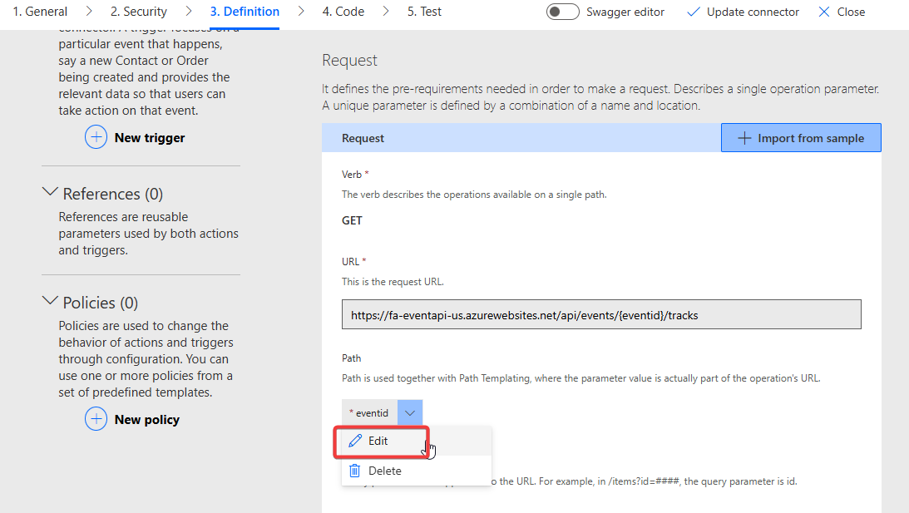

On the detail page we will take a more detailed look at the dropdown types. With these we can change the field from manual input to a dropdown from which a user can easily select a value.

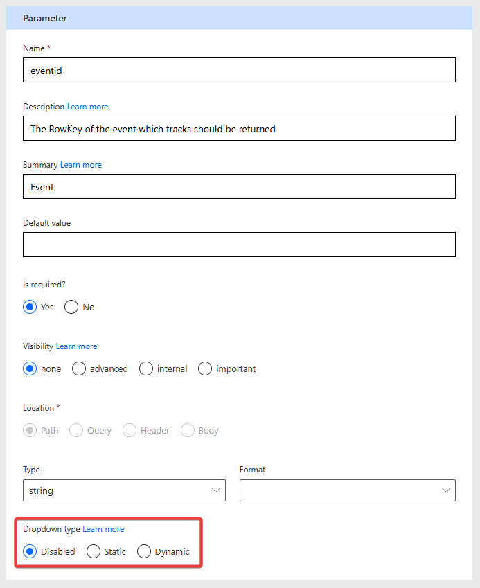

The following options are available

- **Disabled**  Default value, no dropdown, just manual input
- **Static** Dropdown, values must hardcoded in the custom connector. No way to differentiate between id and displayname
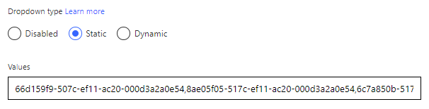
- **Dynamic** Dropdown, but this time the values are provided during runtime by another action 👍

We will use the **Dynamic** option in this case.
- Select our GET/Events action as **Operation Id** (that's why operation id names are important!)
- The **Value** can be picked from the field we defined as the default response in the GET/Events action. If there is no response defined, this feature can not be used! In this case we use the **RowKey** property of the Event because the API is requiring this value.
- The **Value Display Name** will be the field which is only used for the user to make it easier to pick the right value. In our case we use the **Name** property of the Track

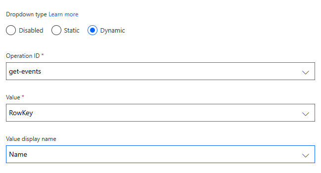

> [!NOTE]
> If after selecting the Operation ID no values for the Dropdowns "Value" and "Value Display Name" are shown, then you have not defined the reponse of that action! Check in the previous lab the part **[Result of Operation](../lab-01/#result-of-operation)**

Awesome let's **Update Connector** and go to our Test page!

## 🪄 Testing in Power Automate
Power Automate, more specifically Power Automate Cloud Flows is at the moment probably the tool using Custom Connectors the most. In order to create our test flow, navigate to your solution (remember the best practice: Everything inside solutions!), by selecting **Solutions** on the left hand side and opening your created solution from before in this lab.

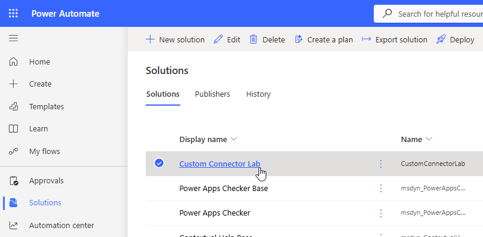

In your solution you should already see your connector 🙂 (sometimes the UI takes a bit to refresh)

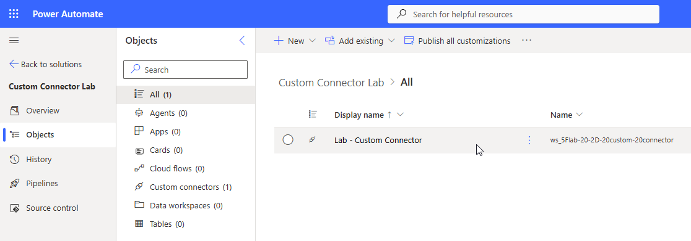

We are going to add a new **Manuel Flow** by clicking on **New** -> **Automation** -> **Cloud Flow** -> **Manual**

Manual means that the flow can be trigger manually via the UI which is usually the easiest for testing and debugging.

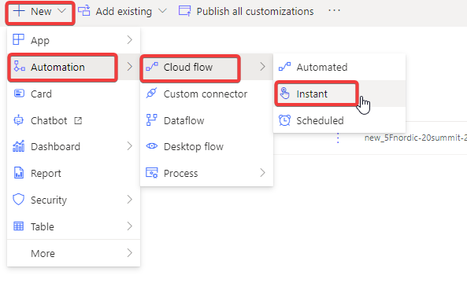

In the creation wizard give the Flow a meaningful name and make sure the trigger **Manually trigger a flow**

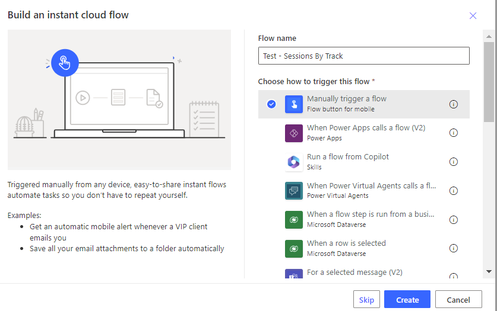 

### Building the Flow

Within our Flow editor we want to add a **New Step**

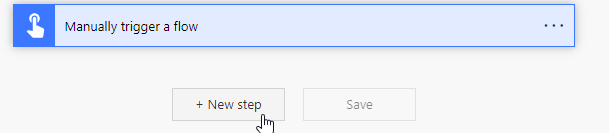

Here you find all available connectors. On the tab **Custom** is our newly created Custom Connector. Here is also a great example why images for custom connectors are important, it helps **a lot** with the discoverability, especially if you have many!

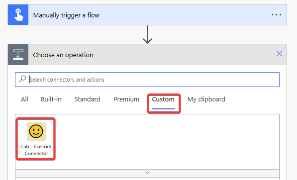

After selecting our Custom Connector we see all available actions we did define in it. Select our GET/SessionsByTrack action.

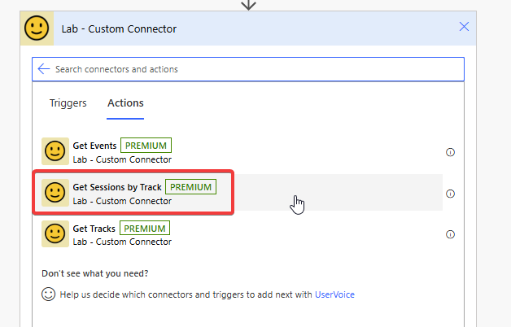

The first time you use a Custom Connector in Power Automate you must create a new connection for security reasons. You can choose any name and reuse the API Key from before.

After we created the connection we do see our parameter field, but this time it is displayed as a dropdown!

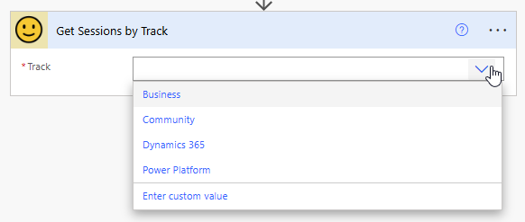

Notice that the values are displayed by their name and not the id even if the API is requiring the id. Let's **Save** our Flow and then do a **Test**.

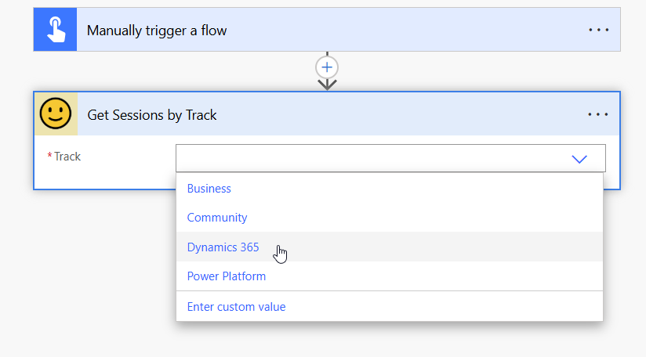

In the Test dialog select **Manually** and then **Run Flow**. If you work with input or automatic trigger the **Automatically** option is powerful because you can easily restart the flow with previous inputs. But for now we are going with Manually.

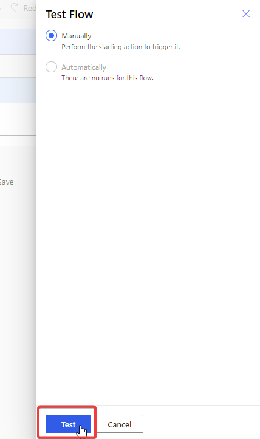

After confirming that you want to run the flow you can close the dialog and will see the results within the editor. You can click on single actions to inspect their in- and outputs.

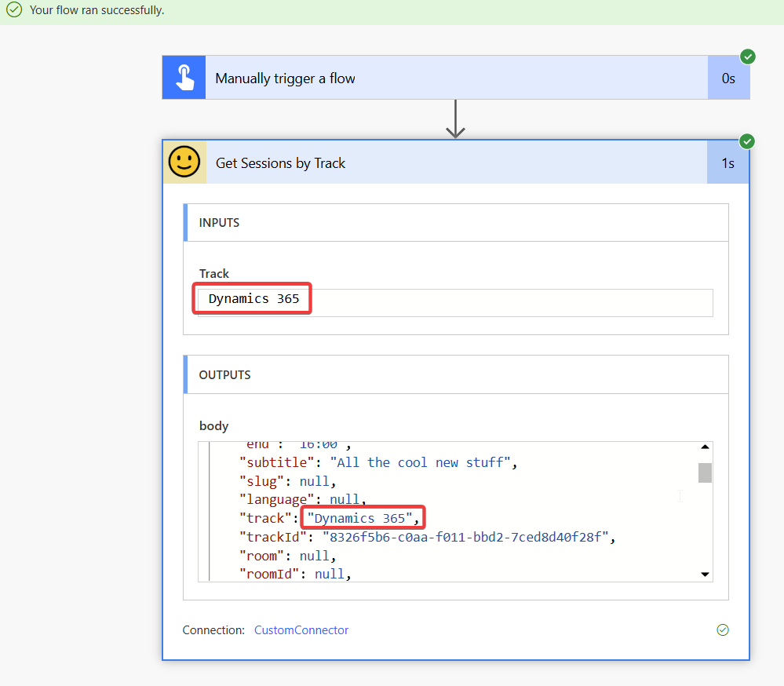

Because we defined the Reponses of all our actions it's also pretty easy to combine them. For example we can use the GET/Tracks action to get an array of all tracks and then iterate through them to get all sessions per track.

For this we add the GET/Tracks action above our GET/SessionsByTrack action and want to use it's output in it. For this you have to select **Enter Custom Value** in the dynamics dropdown to dynamically fill this value (🤪)

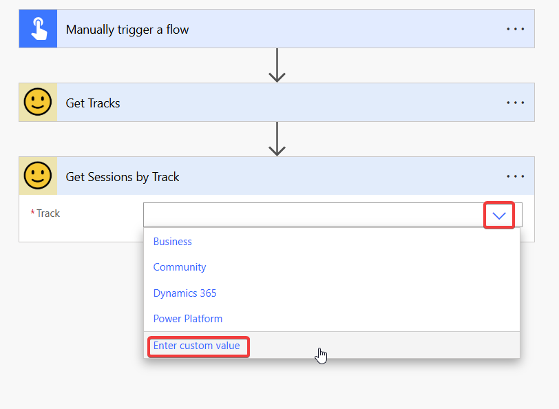

And because we defined the response properties of our GET/Tracks action we can now select them nicely in the UI.

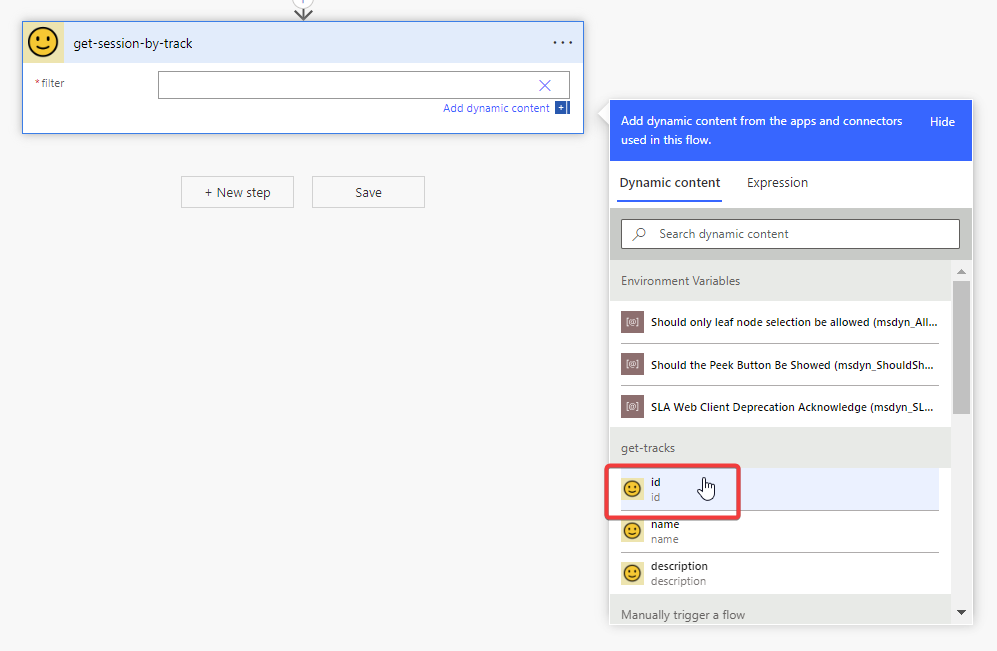

And the Custom Connector also knows that GET/Tracks returns an array, so it automatically wraps the action in an **Apply to Each**

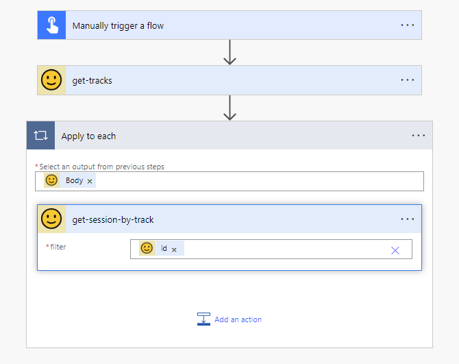