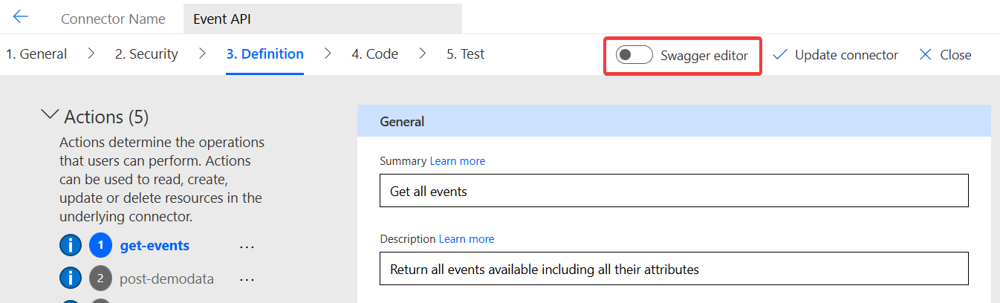
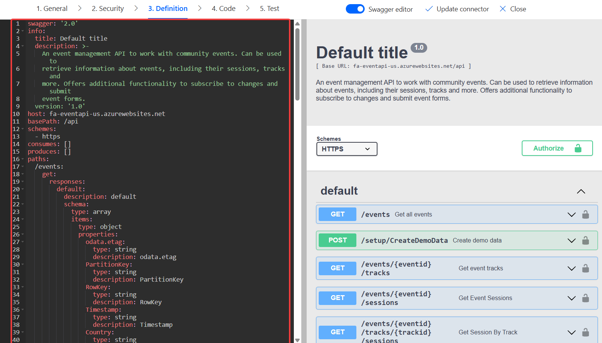
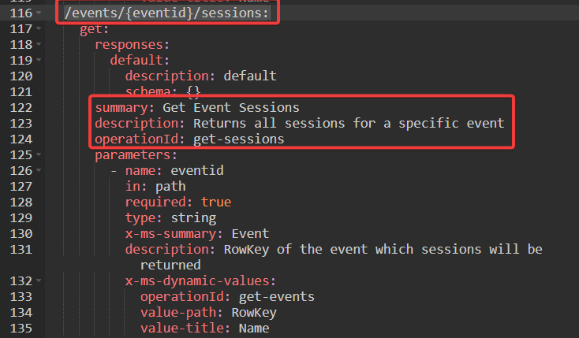
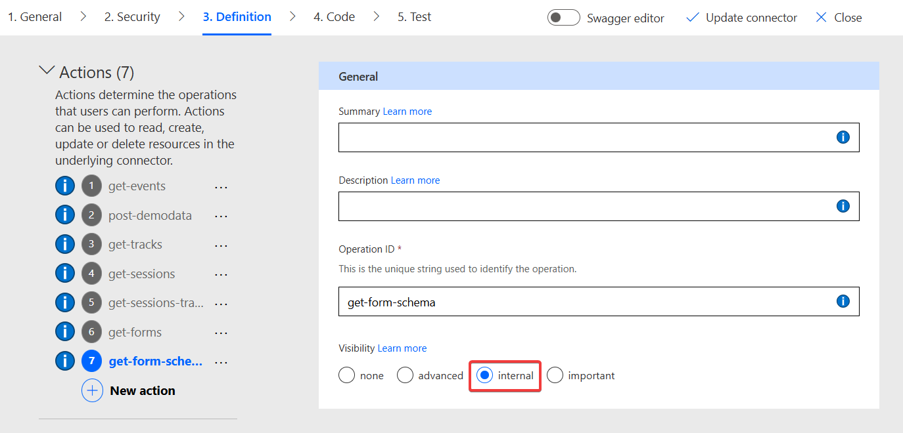
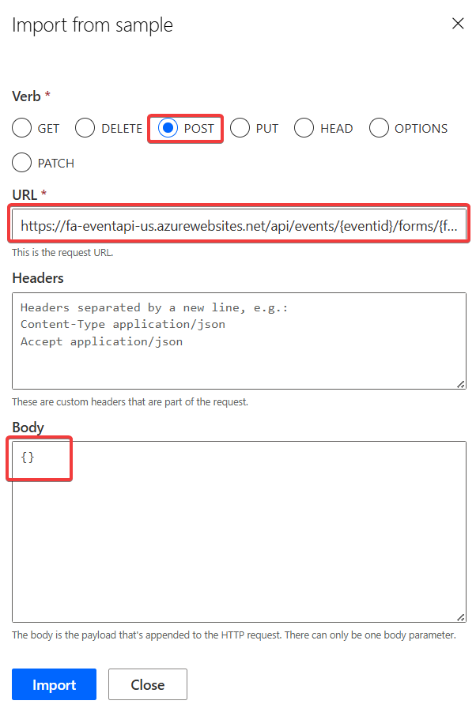
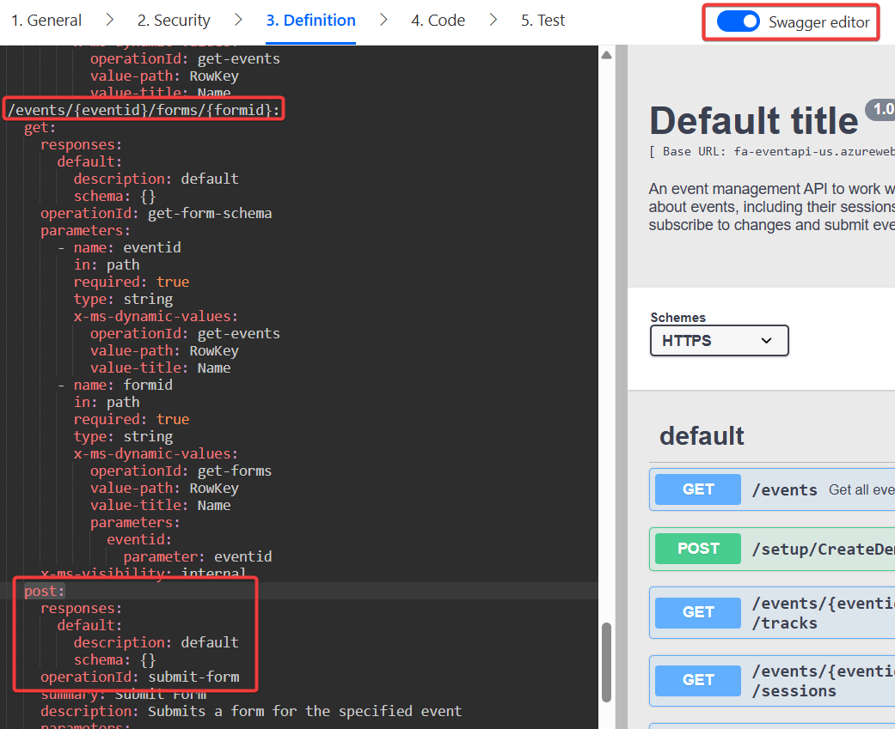
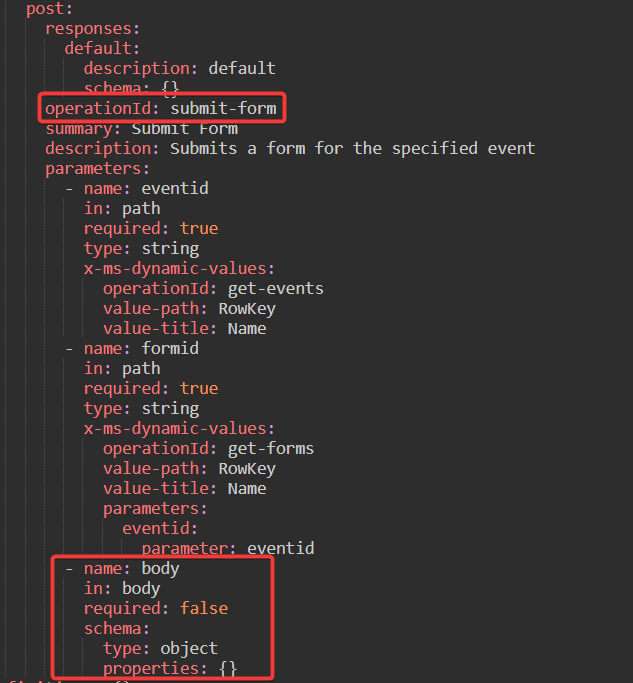
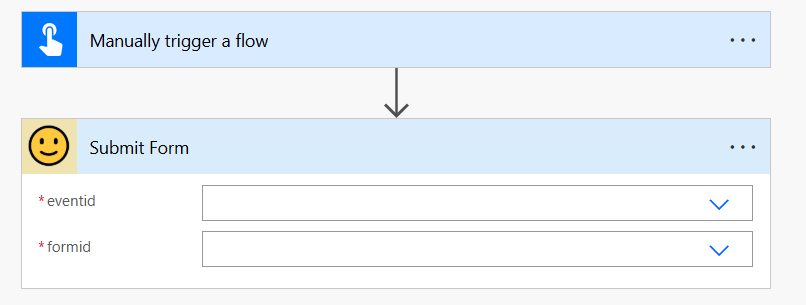
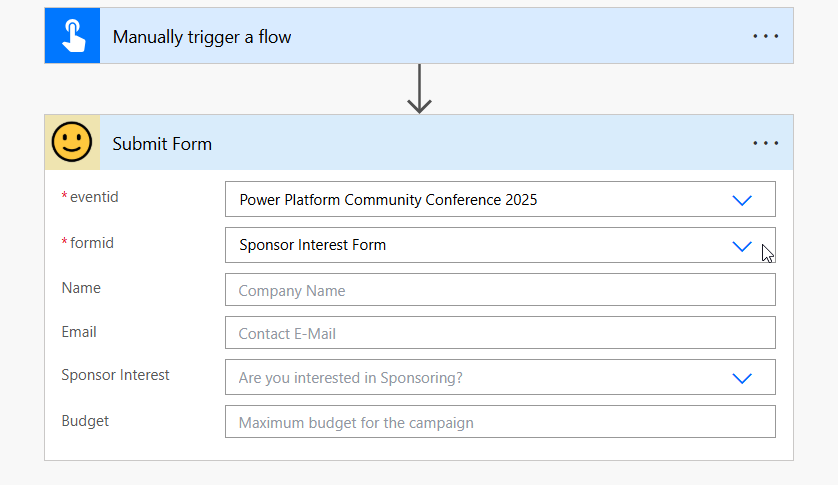

# Lab 03 - Advanced Custom Connector features

In this lab, you will go through the following tasks:

* Learn about the technical background of connectors
* Make responses and schemas dynamics
* Implementing triggers to Custom Connectors

You will extend the connector you started building in the previous lab.

## 😎 Swagger - The "magic" behind connectors
So far we did all our extension and configurations for our Custom Connector directly in the UI, but there are some more hidden features for which there is no UI (yet). For these let's take a look what's behind the scene of connectors. In the end a Custom Connector is basically a huge YAML file. It's important to know that in the end the file is your connector, so sometimes you will have to check here if things go wrong or you want to use a feature not implemented in the UI.

### Access & Use the Swagger Editor

When editing a Custom Connector you can always view and edit the source file by switching the standard UI editor to the **Swagger Editor**. You do this by activating the toggle for it on the top navigation.

When you do so a new editor loads. You can always switch between the two modes and use whatever editor works best for your next step. Both editors edit the same file and will therefore show changes directly.

In the Swagger Editor, the left screen is the actual editor, while the right side shows addtional information and can be used to quickly navigating the file.

Be aware that the sorting order of the actions is different than in the UI editor. In the Swagger editor actions are sorted by their **Url Path** not the Operation-Id. But you have all the attributes you see in the UI editor and more! Use the Swagger editor to make changes to one action. Recommendation: Change **Summary** & **Description** of one + check if you have added Summaries and Description for all actions.

Afterwards change back to the UI editor by using the **Swagger Editor** again and you will see that the attributes you changed are also changed here. Be aware, in order to update your connector you still need to use **Update Connector** in the top navigation.

Small exercise: Look for an action with dynamic parameters and check how the dynamic parameters are represented in the YAML file. In the next steps we will configure a similar feature directly here in the Swagger Editor.

## 🔍 The wonderful Open-Source-Connector World

**TODO**

## 💫 Making Action Schemas dynamic
One of the features you often see in Standard Connector is another dynamic feature: The dynamic Schema. It is used when you selected on parameter in an action, and based on that selection the "schema" aka the fields shown in that action are changed. Probably the most used actions utilizing this feature are in the Dataverse Connector. Every Create / Update action works like this, first you select the Table and based on this the action will show you all available fields of that table, including all customizations only available in the current environment.

In this step we want to add such a feature to our connector as well. The Event API has an endpoint where you can submit Form, and each form can have very different fields. We want to add a Submit Form action were the user first select the Form and then directly sees which fields are available.

### Preparations
For this work we need to add two actions. Add them the same as we did in the Labs before so make sure to:
- Add as action using **Import from sample**
- Fill Operation Id, Summary, Description
- Make parameters dynamic
- Update Connector
- Test action and use result to define Default Response

The two actions are these:

Event API - Get Forms: **GET** request to this url: 
**https://fa-eventapi-us.azurewebsites.net/api/events/{eventid}/forms**  
Returns all available forms for a specific event

Event API - Get Form Schema: **GET** request to this url: 
**https://fa-eventapi-us.azurewebsites.net/api/events/{eventid}/forms/{formid}**  
Returns the schema for a specific form. The Schema describes what fields are in the form and what data type they are.
> [!NOTE]
> The function needs to return the schema as a **OpenAPI Schema** object

We will use the first action to get a list of forms including their ids so that we can used that in the second action to get the schema of that form which is needed so that the Custom Connector knows which fields are available.

Add these actions as described above! So two times to this:
- Add as action using **Import from sample**
- Fill Operation Id, Summary, Description
- Make parameters dynamic
- Update Connector
- Test action and use result to define Default Response

Check **[Result of Operation](../lab-02/#🚀-making-an-action-dynamic)** for a refresher how to add an action like this.

For the **Event API - Get Form Schema** we want to do one special thing. This function will only be needed for the next action, no user will or want ever use it standalone. In order to not confuse them by showing too many options we can hide these kind of action from the UI in Power Automate and other consumers. For this we need to go to the **Definition** of the action and set the **Visibility** to **Internal**. This way we can still use the action normally for other action, but it will not be shown to the user.

Perfect! When you have added these two function let's combine them for the Submit Form action in the next step.

### Add Submit Form action
The Submit Form of the Event API sends a payload in the Body of the request for a specific form of a specific event. The body is a JSON object and what fields should be in there is definied by the schema of the form. So we want to the action to do this:
- Get Event and Form as dynamic parameters
- Use these two parameters to call the GET/Form-Schema action and get the schema
- Use the schema to show the users which fields are available
- Send the entered fields as body to the Submit Form endpoint.

With our prepartion we are almost there!

Let's start by adding the action like we did before. The endpoint is the following:

Event API - Submit Form: **POST** request **with** body to this url: 
**https://fa-eventapi-us.azurewebsites.net/api/events/{eventid}/forms/{formid}**  
Submit a form with the entered data.

Use the **Import From Sample** and make sure to select **POST** add a - for now - empty JSON {} as **Body**.

For the **eventid** and **formid** use the UI to make the parameters dynamics as we did with the previous actions.

When you go to the **body** parameter and click on **Edit** you see that we do not have the option here in the UI to make it dynamic. This is a feature which we can only edit directly in the Swagger Editor. So go back to the action definitions and toggle the **Swagger Editor** and search for the submit-form action there.

You will see that the body parameter is defined, but has currently no details added to it. We will overwrite this parameter manually in the Swagger Editor.

**Before**  
- name: body  
        in: body  
        required: false  
        schema:  
        type: object  
        properties: {}

**After**
``- name: body  
          in: body  
          required: false  
          schema:  
            type: object  
            properties: {}``

After you made these changes, **Update Connector** and go back to Power Automate and create a new Flow **Submit Form** and add the action **Submit Form**. 

At the beginning before you have filled the parameter you will only see the two parameter we had defined in our action.

After you fill the two parameter - and wait a few seconds for the connector to make the call to grab the schema, depending on what schema you picked the action will show it's fields.

