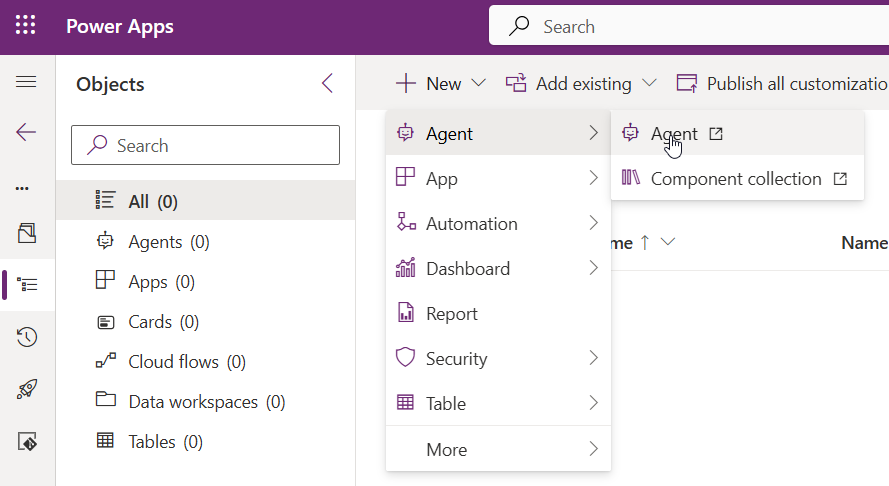
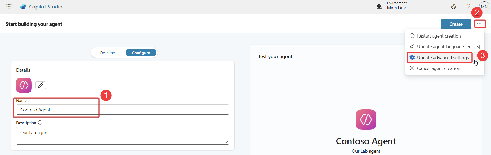
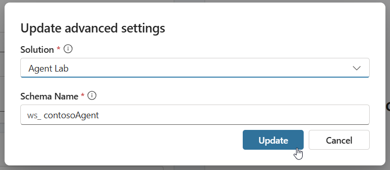

# Lab 04 - Integration in Copilot Studio

In this lab, you will go through the following tasks:

* How to build an agent in Copilot Studio
* How to add your Custom Connector to your agent

You will extend the connector you started building in the previous lab.

## 🤖 Create an agent
Power Automate is great for a lot of automation use case, but nowadays agents are becoming more important for a multitude of use cases. And the great news is that they support Custom Connectors! In fact are Custom Connectors one of the easiest ways to extend an agent with custom datasources in a low code way. Let's do that for our Event Custom Connector and create an Event agent!

As always in Power Platform we are going to start in a **Solution**, so navigate there and let's start creating our agent. Navigate to your newly created solution select **New** -> **Agent** -> **Agent**, this will redirect you to Copilot Studio where all the agent magic happens.

### Copilot Studio

Now we are in the Agent editing experience. First step give the agent a name. If you started in the solution to create the agent it will already be linked, if you started in Copilot Studio you connect the Agent with our solution, for this select the three dots and select **Update advanced settings**.

Select the solution you created before and press **Update**. Now your agent is attached to your solution.

After creating the agent, add **Instructions**. In our lab we are going to create an agent to help users picking new devices when ordering with internal IT.
