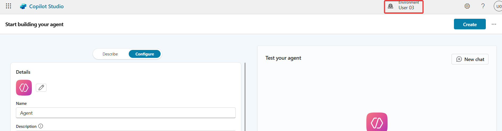
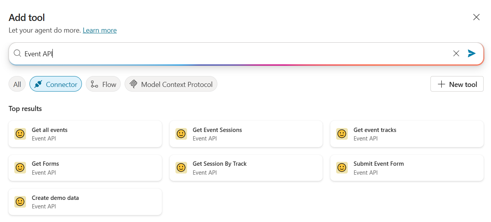
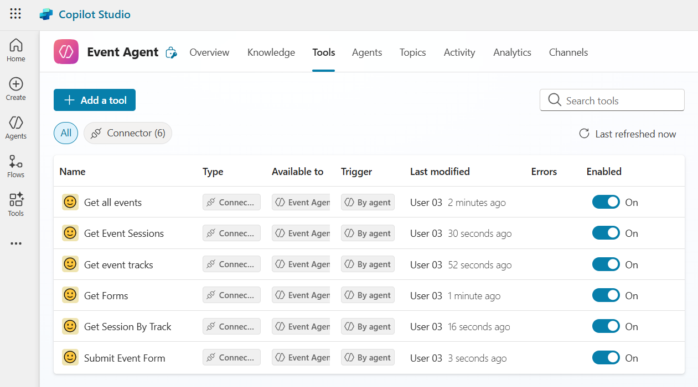
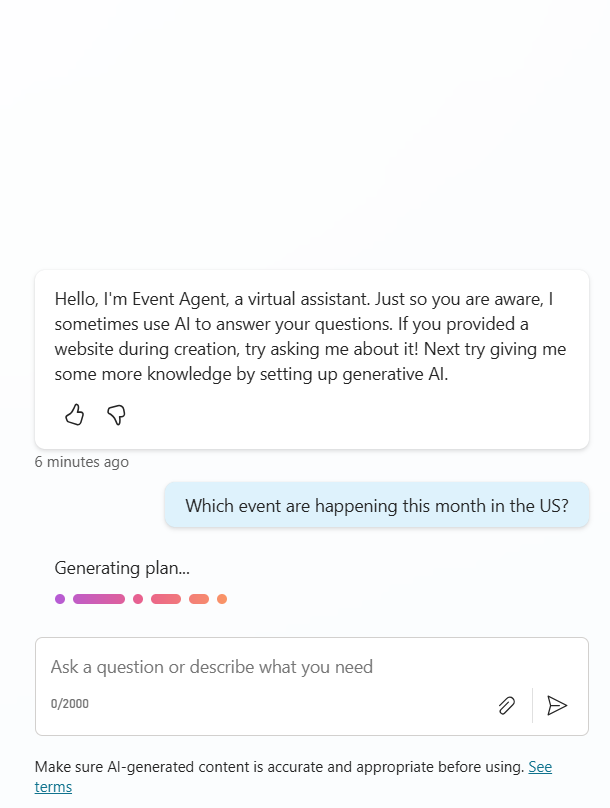
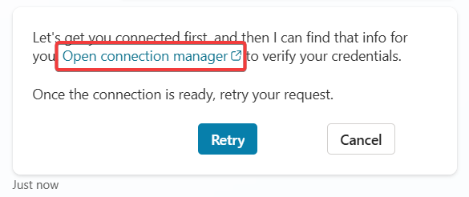
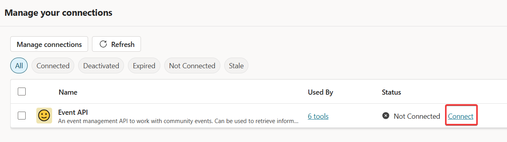
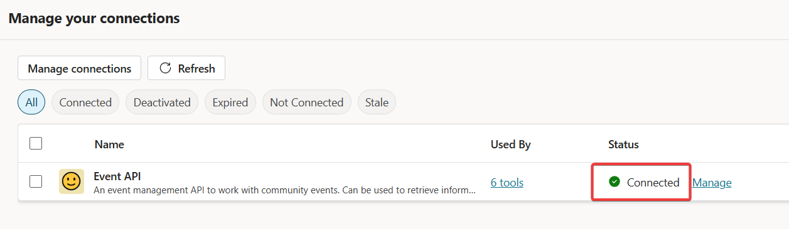
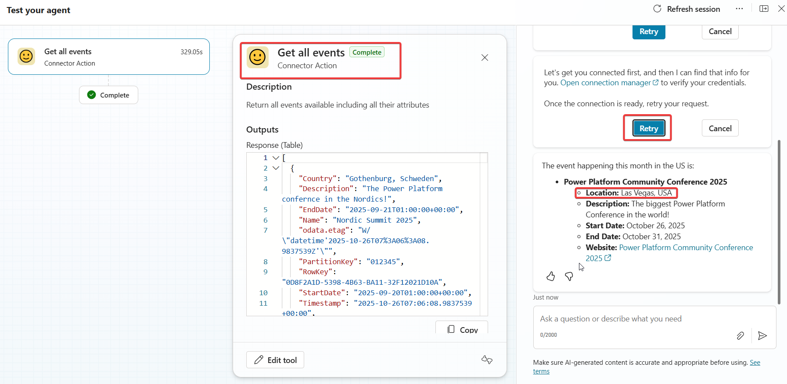

# Lab 04 - Integration in Copilot Studio

In this lab, you will go through the following tasks:

* How to build an agent in Copilot Studio
* How to add your Custom Connector to your agent

You will extend the connector you started building in the previous lab.

## 🤖 Create an agent

Power Automate is great for a lot of automation use case, but nowadays agents are becoming more important for a multitude of use cases. And the great news is that they support Custom Connectors! In fact are Custom Connectors one of the easiest ways to extend an agent with custom datasources in a low code way. Let's do that for our Event Custom Connector and create an Event agent!

As always in Power Platform we are going to start in a **Solution**, so navigate there and let's start creating our agent. Navigate to your newly created solution select **New** -> **Agent** -> **Agent**, this will redirect you to Copilot Studio where all the agent magic happens.


Make sure that Copilot opens in your environment, you can check it in the top right corner.



### Copilot Studio

Now we are in the Agent editing experience. First step give the agent a name. If you started in the solution to create the agent it will already be linked, if you started in Copilot Studio you connect the Agent with our solution, for this select the three dots and select **Update advanced settings**.


Select the solution you created before and press **Update**. Now your agent is attached to your solution.


Give your agent a name and click on **Create** to create it!

## 📝 Basic setup for agent

Now that we have our agent created and connected to our solution, let's configure the foundational settings that will define how our agent behaves and responds to users.

### 🎯 Agent Instructions

The **Instructions** are the core directive that guides your agent's behavior. This is where you define the agent's purpose, personality, and how it should interact with users. Think of this as the agent's "job description" and behavioral guidelines.

To configure your agent instructions:

1. In Copilot Studio, make sure you're in the **Overview** tab of your agent
1. Look for the **Instructions** section
1. Click on the text area to start defining your agent's behavior

**What to include in your instructions:**

For an Event Management agent using our Custom Connector, here's an example of what you should configure (thanks Copilot! ✌️):

```text
You are an Event Assistant that helps users get more information about specific events. 
Your primary responsibilities include:

- Helping users search for and find events based on their interests, location, or date preferences
- Providing detailed information about specific events including date, time, location, and description
- Assisting users with form submissions
- Answering questions about event details, especially their sessions and available tracks

When interacting with users:
- Be friendly, professional, and helpful
- Ask clarifying questions when user requests are ambiguous
- Provide concise but complete information
- If you don't have specific information, let the user know and offer to help in other ways
- Always confirm actions before submitting registration forms

Use the available event tools to retrieve real-time event information and process registrations.
```

**Key principles for writing good instructions:**

* **Be specific**: Clearly define what the agent should and shouldn't do
* **Set the tone**: Define whether your agent should be formal, casual, technical, etc.
* **Define boundaries**: Explain what topics or actions are in scope vs out of scope
* **Provide context**: Explain what tools/connectors are available and when to use them
* **Include examples**: If relevant, include example scenarios or conversation patterns

### 🔧 Additional Configuration Options

Before moving on to adding the Custom Connector, consider these additional settings:

**Suggested Prompts**: Define sample questions or prompts that users can click to start interacting with your agent. Examples:

* "Show me upcoming events"
* "What events are happening this month?"

**Agent icon and description**:

* Upload a custom icon that represents your agent
* Write a clear description of what your agent can help with

These settings can be found in the agent's **Overview** menu.

Now your agent has a solid foundation and is ready to be enhanced with the Custom Connector actions!

## 💯 Adding the Custom Connector to your agent

Now let's navigate back to Copilot Studio to add our Custom Connector to an agent. In Copilot Studio click on **Tools** and **Add Tool**


Select **Connector** and search for your connector name, you will see all the actions you defined before!



You can add multiple Actions as tools, go ahead and add the actions which make sense for the agent. For example it probably does not make a lot of sense to add the "Create Demo Data" action to your agent since this should only be executed once.

Once you click on an action to add you have to confirm it's connection in the next screen. Click **Add to agent** to add this specific action. Repeat for actions you want to add.

After adding the tools your tool tab should look similar to this:



Time to test our agent!

## 🔥 Testing the agent

Copilot Studio has a great test pane directly integrated on the right hand side, use it to write all kind of test prompts:



On your first prompt you will probably get a message that the connection is not working, do not click on Retry but instead on **Open Connection Manager**



In the connection manager look for your Custom Connector and click on **Connect**



In the next screen it should pick up your existing connection, alternatively you could create a new one using your API Key. Click on **Submit** to continue. If your connection manager afterwards shows **Connected** you can close its tab and go back to the test pane.



In the Test Pane you can now click on **Retry** and the prompt should be executed.



Success! Our agent figured out that it should use our action and found a correct answer to our prompt!

## 🙏 Play around and test the limits

Go ahead and try to get the agent to use the actions, especially the ones which need input from other actions. You will see that different prompts can lead to very different results.

**Tip** if you get a similar error like this, then you didn't configure the default responses in your Custom Connector. Go ahead and fix it, afterwards it's recommended to remove that action as a tool from the Agent and add it again so that the Agent gets the newest metadata from it.


